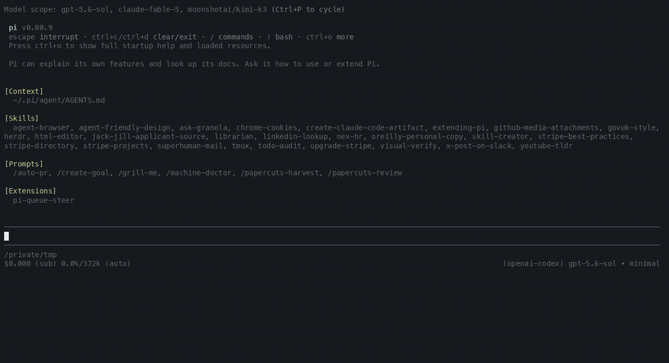

# pi-queue-steer

[](LICENSE)

A visible steering and follow-up timeline for [Pi](https://github.com/earendil-works/pi-mono).

Personal fork of [tmustier/pi-queue-steer](https://github.com/tmustier/pi-queue-steer), with customized queue controls and presentation.

Queue instructions while the agent works. Steering stays in a blue box and follow-ups stay in a yellow box beneath it. Both lanes preserve Pi’s delivery timing and can be reordered before delivery.

Move into any row to edit it. The selected row becomes the live Pi editor, with its cursor, wrapping, paste handling, autocomplete and custom-editor behaviour intact.

## Demo



## Install

Install the private repository over SSH:

```bash
pi install git:git@github.com:alivault/pi-queue-steer
```

Then start a new Pi session or run `/reload`.

Try a local checkout for one session:

```bash
pi -e ./index.ts
```

## Controls

The extension follows your configured Pi action bindings. These are the default keys on macOS terminals:

| Context | Key | Action |
|---|---|---|
| Agent working | `Enter` | Add visible steering for Pi’s next safe turn boundary |
| Agent working | `Option+Enter` | Add a visible follow-up for after the run |
| Queue visible | `Option+Up` | Enter editing at the most recently queued row |
| Editing a row | `Up` or `Down` | Keep the current draft and select the previous or next visual row |
| Autocomplete visible | `Up` or `Down` | Navigate suggestions without changing the selected queue row |
| Editing a row | `Option+Up` or `Option+Down` | Move the selected row; crossing a section boundary moves it to the other lane |
| Editing a row | Type normally | Edit directly inside the selected row |
| Editing a row | `Option+X` | Mark the selected row for removal; save deletes it, a second press restores it |
| Editing a row | `Enter` or `Option+Enter` | Save all row edits and queue moves |
| Editing a row | `Escape` | Cancel the session and roll back all unsaved row edits |
| Empty composer, follow-up queued | `Enter` | Promote the oldest follow-up to steering now |
| Queue paused after an abort | `Enter` | Resume from the next steering row, or the next follow-up |
| Agent working, queue visible | `Escape` | Abort the run and pause both visible lanes |

The arrow, `Option+Arrow`, and `Option+X` controls are fixed shortcuts. The other controls use Pi’s configured action bindings. Terminals outside macOS may label `Option` as `Alt`. On-screen help always uses compact symbols such as `↑↓`, `⌥↑↓`, and `⌥X`.

## Delivery semantics

The extension keeps Pi’s 2 delivery classes:

- steering reaches the current run at Pi’s next safe turn boundary
- follow-ups wait until the run finishes
- the blue steering box remains above the yellow follow-up box
- each lane delivers from top to bottom in its visible order
- Pi’s `one-at-a-time` and `all` settings apply independently at active-run delivery boundaries

The extension hands messages back to Pi’s native queues only when their delivery boundary arrives. They remain visible and editable before that point. Pi records delivered rows as normal user messages.

## Status icons

- `◆` / `◇` — ready or later steering message
- `●` / `○` — ready or later follow-up
- `⏸` — queue paused after an abort
- `◈` — delivery held while the row is being edited
- `›` — selected row
- `×` — marked for removal

## Editing semantics

- `Option+Up` starts editing at the row you queued most recently
- `Up` and `Down` then select rows through the visible timeline, except while autocomplete is open
- autocomplete keeps its normal `Up` and `Down` suggestion navigation
- `Option+Up` and `Option+Down` reorder the selected row within its section
- moving past a section boundary transfers the row to the adjacent lane at that boundary
- queue moves preview immediately and commit only when the editing session is saved
- the shared help line shows the selected lane position, such as `steer 2/4`
- it also shows `• unsaved` whenever text, order, lane, or removal changes are pending
- `Option+X` marks the selected row for removal; save deletes it, and `Escape` or a second `Option+X` restores it
- a selected row becomes the real editor without a nested composer frame
- one editing session can hold drafts for several rows
- `Escape` restores every row from the session snapshot, including removal marks and queue moves
- saving an empty text-only row removes it
- image-only rows survive text clearing; `Option+X` removes them
- an unrelated composer draft is stashed and restored when editing ends

A touched head row is pinned until you save or cancel. In `one-at-a-time` mode, later rows do not block the head. In `all` mode, editing any row holds that whole lane at active-run delivery boundaries.

## Abort and recovery

Aborting a run pauses both visible lanes. This prevents a follow-up from starting immediately after the abort.

Press `Enter` on the empty composer to resume. A failed handoff returns the affected batch to the front of its lane.

Queue state, pause state and edit drafts are session-local. They never enter the Pi transcript.

## Proof limitation

If an `all`-mode lane stays pinned until the agent settles, saving from idle restarts the run with that lane’s head. Pi receives the remaining rows at the next native boundary. Exact single-batch restart after this edge case remains open before release.

## Editor composition

pi-queue-steer wraps the active Pi editor. It does not replace Pi’s input model.

For display, it extracts the live editor’s text and cursor from the editor frame. It then places that content inside the selected queue row. Autocomplete remains below the edited text.

The extension composes with custom editors including raw-paste and pi-session-hud.

## Development

Run the local checkout directly:

```bash
pi -e ./index.ts
```

Check TUI changes in a real interactive Pi session.

## Security

Pi extensions run with the same system permissions as Pi. Review extension source before installing a third-party package.

## Licence

MIT. See [LICENSE](LICENSE).

This project draws on Cursor’s queue interaction. It is not affiliated with Cursor or Anysphere.
